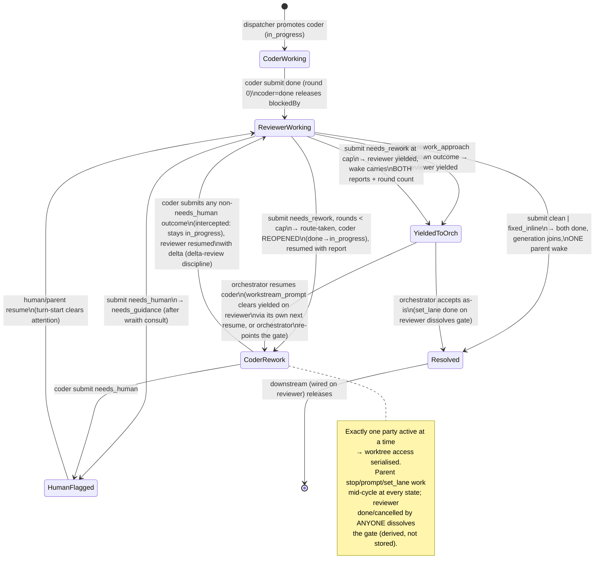

---
manager_sessions:
  - id: 849dae7c-d40f-4ba2-abec-fc2aa51de24e
    role: plan
    authored_at: 2026-07-02T13:47:32.687Z
---

# Workstream review gates — outcome-routed loops in the orchestration graph

**Status:** design + phased implementation plan (no code in this doc)
**Author:** planner sub-thread (T3 Code Workstream), 2026-07-02
**Scope:** turn the workstream's strict DAG into a graph with first-class,
outcome-conditional loop edges, so a coder→reviewer→coder feedback cycle runs
under control-plane routing without waking the orchestrator; ship the review
gate as the v1 use of the generic primitive.

The product decisions in this document are settled (brainstormed to
convergence by Carl and the orchestrator). What this doc adds is the grounding:
real module names, concrete contract changes, exact touchpoints, and a phased
build order. Where a settled decision left naming/schema/placement open, it is
resolved here against the code as it stands.

---

## 1. Current state (what the code actually does today)

The control plane is an event-sourced command pipeline:

- **Contracts** — `packages/contracts/src/orchestration.ts`. `ThreadPlanLane =
planned | ready | in_progress | done | cancelled`. Commands
  (`thread.plan-lane.set`, `thread.report.set`, `thread.turn.start`, …) decode
  into events (`thread.plan-lane-set`, `thread.report-set`, …) applied by the
  projector.
- **Decider** — `apps/server/src/orchestration/decider.ts`. The single
  authorisation chokepoint. `in_progress` is control-plane-only (rejected
  unless the commandId is `server:`-prefixed); `done` clears stored attention;
  `cancelled` cascades over the subtree; turn-start on a `done`/`cancelled`
  thread is _sticky-terminal_ (a silent re-engagement that changes no lane).
- **Dependencies** — `packages/shared/src/workstreamDependencies.ts`.
  `areDependenciesSatisfied`: a `blockedBy` entry gates only when it names a
  known **sibling** whose lane is not `done`. `done` is the only releasing
  lane.
- **Dispatcher** — `apps/server/src/orchestration/Layers/WorkstreamDispatcher.ts`.
  Three passes on a drainable worker: `promoteReadyThreads` (kick off `ready`
  children whose deps cleared, with an atomic `setInProgress` turn-start),
  `wakeEligibleParents` (the generation join: children grouped by
  `(parentThreadId, spawnGeneration)` via
  `selectJoinedGenerations`/`isTerminalForJoin` in
  `packages/shared/src/workstreamGraph.ts`; the parent is woken once the whole
  generation is `done`/`cancelled`), and `wakeIdleAndErroredChildren` (per-child
  rails: `error`, paused-`attention`, forgot-to-finish `idle` — which raises
  `needs_guidance` — `recovered`, `slow-tool`). All wakes are receipt-deduped
  `thread.turn.start`s with `requireIdle`.
- **Reports** — `apps/server/src/orchestration/workstreamReport.ts` writes
  markdown to `<stateDir>/workstream-reports/<threadId>.md`; the pointer is
  event-sourced via `thread.report.set`. A child today ends with **two** calls:
  `workstream_report` then `workstream_set_lane(done)`.
- **Agent tool surface** — the pi extension
  (`apps/server/src/provider/Drivers/Pi/WorkstreamSpawnExtension.ts`, generated
  into each session's state dir) calls HTTP endpoints in
  `apps/server/src/mcp/WorkstreamSpawnHttp.ts`. Auth: a credential may act on
  its own thread or a thread it directly parents (`authorizationError`).
  `workstream_prompt` **rejects** a `done`/`cancelled` target (409).
- **Kick-off prompt** — `apps/server/src/orchestration/workstreamChildPrompt.ts`
  teaches every child the report-then-set-lane protocol.
- **Role overlays** — `roles/*.md`, loaded per-thread by
  `apps/server/src/orchestration/roleOverlay.ts`.
- **Renderer** — `apps/web/src/components/WorkstreamGraph.tsx` +
  `apps/web/src/lib/workstreamGraph.ts` (`computeForkJoinLayout`): the
  fork–join band layout from `docs/plans/workstream-fork-join-graph.md`. Edge
  kinds today: solid `spine`, bezier `fork`, dashed-amber `waits-on`. Lane
  styling lives in `apps/web/src/lib/workstreamPresentation.ts`
  (`COLUMN_ORDER`, `STATUS_STYLES`).

What cannot be expressed: a reviewer handing work _back_. There is no cycle
edge, no structured verdict, no non-terminal way to wake the parent short of a
human attention flag, and `selectThreadsToDispatch` only ever starts a thread
**once** (`session === null && latestUserMessageAt === null`).

---

## 2. Design overview

One picture, the common case (coder + reviewer spawned in the same
orchestrator turn, reviewer `blockedBy` coder, gate declared on the reviewer):

```
orchestrator ──spawns──▶ coder ──done──▶ reviewer          (blockedBy edge, as today)
                           ▲                │
                           │   needs_rework │  (loop edge, control-plane routed,
                           └────────────────┘   round-capped, orchestrator asleep)

reviewer submits clean/fixed_inline → gate resolves → coder+reviewer done
                                    → generation joins → ONE parent wake
reviewer submits rework_approach    → reviewer lane = yielded → parent woken now
loop rounds exhaust the cap         → reviewer lane = yielded → parent woken now
reviewer submits needs_human        → needs_guidance flag (human), as today
```

Three new primitives carry all of it:

1. **One terminal call** (`workstream_submit`): report markdown + a structured
   outcome. The control plane derives the lane; agents stop setting `done`
   themselves.
2. **Route edges** on a thread (`routes` in the contract): outcome-predicated
   edges the decider consults when a submit lands. v1 exposes only the
   review-gate sugar at spawn time; the wire shape is generic.
3. **The `yielded` lane**: turn over, parent woken with the report, thread
   neither terminal nor releasing. The escalation valve that is _not_ a human
   flag.

Routing is decided **in the decider** (pure, from the read model:
routes + recorded rounds) and **executed by the dispatcher** (a new gate-routing
pass that injects the loop-back turn, exactly the shape of the existing wake
rails: deterministic `server:` command ids, receipt-deduped, crash-safe).

---

## 3. The terminal call: `workstream_submit`

### 3.1 Naming and shape

Chosen name: **`workstream_submit`** — it reads correctly for every round
("submit your work", "submit your verdict"), unlike `complete`/`finish` which
lie during a `needs_rework` round. It **replaces** `workstream_report`; the old
tool and the agent-side `workstream_set_lane(done)` completion step are removed,
not kept alongside (prototype rule: migrate, don't shim).

Tool parameters (pi extension → `POST /provider-tools/workstream/submit`):

```jsonc
{
  "markdown": "…", // required — the freeform report, human-first, unchanged in spirit
  "outcome": "needs_rework", // optional token; omitted ⇒ "done"
  "contested": ["finding-3: …"], // optional — findings this party rejects, verbatim-quotable
  "counts": { "mustFix": 2, "niceToHave": 3 }, // optional — reviewer finding counts for the verdict chip
}
```

Deliberately no `rounds` field — the control plane counts rounds itself
(agents must not self-report loop state). `contested` and `counts` are opaque
to routing; they exist for the audit trail and the UI chip.

### 3.2 Server command and events

The HTTP handler writes the report file (existing `writeWorkstreamReport` —
overwrite-latest stays the rule; see risk R6) and dispatches one new command:

```
thread.work.submit { commandId, threadId, reportPath, outcome, contested?, counts?, createdAt }
```

This **replaces** `thread.report.set` as a command (the `thread.report-set`
_event_ stays in the enum so history replays). The decider emits, in one
transaction:

- `thread.report-set` (pointer, as today), then
- `thread.outcome-recorded` — new event: `{ threadId, outcome, round,
decision, contested?, counts?, updatedAt }` where `decision` is the routing
  verdict (`terminal | loop | resolve | yield | cap-breach | attention`), then
- the lane events the decision implies (see §5).

### 3.3 Outcome semantics (the generic rule)

Two reserved tokens, one generic fallback — no workflow language:

| outcome             | control-plane meaning                                                                                                                                                                                 |
| ------------------- | ----------------------------------------------------------------------------------------------------------------------------------------------------------------------------------------------------- |
| `done` (or omitted) | plain completion → lane `done` (+ attention clear), dependents release. Exactly today's semantics, one call instead of two. Threads that don't participate in routing never notice the new machinery. |
| `needs_human`       | sugar for the existing human flag: `thread.attention-raised needs_guidance`, lane untouched (`in_progress`).                                                                                          |
| any other token     | consult the thread's `routes`. A matching `loop` edge under its cap → route. A matching `resolve` edge → gate resolution. **No match → lane `yielded`** (report-and-yield to the live orchestrator).  |

The "unknown outcome yields" default is load-bearing: `rework_approach` needs
no declared edge, a future researcher's `infeasible` needs no declared edge,
and no outcome can ever silently become `done`. Escalation is the safe default.

---

## 4. Route edges and the review gate

### 4.1 Contract shape (generic)

New field on `OrchestrationThread` / `OrchestrationThreadShell` (and the
`thread.create` command + `thread.created` event payload):

```ts
export const WorkstreamRoute = Schema.Struct({
  on: Schema.Array(TrimmedNonEmptyString), // outcome tokens this edge matches
  kind: Schema.Literals(["loop", "resolve"]),
  to: Schema.optional(ThreadId), // loop target (required for kind=loop)
  maxRounds: Schema.optional(NonNegativeInt), // loop only; default DEFAULT_GATE_MAX_ROUNDS = 2
});
// on the thread:
routes: Schema.Array(WorkstreamRoute); // decode-default []
```

Plus two projected counters fed by `thread.outcome-recorded` /
`thread.route-taken` events:

```ts
gateRounds: NonNegativeInt   // loop traversals consumed (decode-default 0)
lastOutcome: Schema.NullOr(Schema.Struct({ outcome, decision, round, counts?, at }))  // UI chip
```

`routes` live on the thread that _emits_ the outcomes (the reviewer). One
declared loop edge defines the whole cycle — the control plane routes both
directions on it (reviewer→coder on `needs_rework`, coder→reviewer on the
coder's next submit). No reverse edge is stored.

A **gate** is not a stored object; it is the derived pair
`(source = the thread carrying a loop route, target = that route's to)`. A
gate is **unresolved** while its source is non-terminal
(`planLane ∉ {done, cancelled}`). This derivation is deliberate: a parent that
`workstream_set_lane`s the reviewer to `done` or `cancelled` (decision 9,
interruptibility) dissolves the gate with no extra bookkeeping, and every
suppression below keys off the same predicate.

### 4.2 v1 surface: the `gate` spawn parameter

`workstream_spawn` gains one optional parameter (v1 ships no raw-routes
surface):

```jsonc
{
  "role": "reviewer",
  "blockedBy": ["<coderId>"],
  "gate": { "rework": "<coderId>", "maxRounds": 2 }, // maxRounds optional, default 2
}
```

`WorkstreamSpawnHttp.handleWorkstreamSpawn` compiles it to:

```ts
routes: [
  { on: ["needs_rework"], kind: "loop", to: gate.rework, maxRounds: gate.maxRounds ?? 2 },
  { on: ["clean", "fixed_inline"], kind: "resolve" },
];
```

Validation at spawn: `gate.rework` must name an existing thread with the same
`parentThreadId` (the sibling rule mirrors `areDependenciesSatisfied`), and the
spawner must be that parent — this is the **pre-authorisation** for
sibling→sibling delivery: the parent declared the edge, so the control plane
may deliver one sibling's report into the other without any new agent-side
permission.

### 4.3 Routing decisions, precisely

Let `R` = reviewer (loop-edge source), `C` = coder (loop-edge target).

**R submits `needs_rework`, `gateRounds < maxRounds`:**
decider emits `thread.outcome-recorded` (decision `loop`, round = gateRounds+1)
and `thread.route-taken { from: R, to: C, round }`. R's lane stays
`in_progress` (it is waiting in the gate — see §6 for why this doesn't trip
the idle nag). The dispatcher's gate pass reacts to `route-taken`: it reads
R's report and dispatches a `thread.turn.start` on C with

- command id `server:workstream-gate:<R>:<round>:rework` (receipt-deduped,
  crash-safe, idempotent across restarts — same pattern as `wakeCommandId`);
- message: control-plane marker (`WORKSTREAM_CONTROL_PLANE_MARKER`) + "review
  round `<n>` — the reviewer returned findings" + the report (bounded excerpt +
  `reportPath` reference, reusing `formatReportExcerpt`) + the adjudication
  protocol reminder + routing visibility ("your next submit routes back to the
  reviewer, not to done");
- `reopen: true` — a new server-only `thread.turn.start` flag that overrides
  sticky-terminal for exactly this case: C is `done` (its round-0 completion
  released R via the ordinary `blockedBy` edge), and the resume must atomically
  flip it back to `in_progress` in the same engine transaction, the mirror
  image of the existing `setInProgress` kickoff flag. The decider accepts
  `reopen` only on `server:`-prefixed command ids and only from `done` (never
  `cancelled` — a cancelled thread stays dead).

**C (target of an unresolved gate, with an open rework round) submits:**
"open rework round" ≝ `route-taken(R→C)` events outnumber C's subsequent
routed-back submits — projected as a small `pendingRework: boolean` on C
(set by `route-taken`, cleared by C's next `outcome-recorded`). While
`pendingRework`:

- any non-`needs_human` outcome is **intercepted**: decision `loop`, C's lane
  stays `in_progress`, `route-taken { from: C, to: R, round }` is emitted, and
  the gate pass resumes R with C's delta report (command id
  `server:workstream-gate:<R>:<round>:reverify`; R is `in_progress`-idle, so a
  plain turn-start resumes it — no reopen needed). The resume message tells R
  it is a delta review: scope to the delta plus previously flagged items.
- outcome `needs_human` behaves as always (flag, halt).

Crucially, C's **round-0** submit (before any `route-taken` exists) is a plain
`done` — that is what releases R through the ordinary dependency edge. The
interception only exists inside rework rounds.

**R submits `clean` or `fixed_inline` (a `resolve` edge):**
decision `resolve`. The decider emits lane `done` for **both** R and C in the
same transaction (multi-aggregate events in one command follow the
cancel-cascade precedent in `decider.ts`). C is usually already `done`
(round 0, no loop ever taken) — then only R's lane event is emitted. Dependents
wired on R (or on both) release; if C and R share a `spawnGeneration`, the
generation joins here and the parent gets **one** wake carrying both reports.
`fixed_inline` is routing-identical to `clean` — it exists as a distinct token
purely so humans can audit reviewer-authored fixes (surfaced on the verdict
chip and in `thread.outcome-recorded`).

**R submits `needs_rework` at the cap (`gateRounds === maxRounds`):**
decision `cap-breach`. No route. R's lane → `yielded`. The dispatcher's yield
rail (§6) wakes the parent with **both** parties' latest reports and the round
count. Cap breach never goes straight to the human.

**R submits `rework_approach`** (or any undeclared token): decision `yield`,
lane → `yielded`, parent woken. The orchestrator decides same-coder vs
fresh-coder: resume C itself via `workstream_prompt`, or spawn a replacement
coder and re-point the gate (a fresh reviewer spawn with `gate` against the new
coder — or `workstream_set_lane(cancelled)` on the stale pair and a fresh
gate pair; guidance covers both).

### 4.4 Round accounting

`gateRounds` counts **reviewer→coder traversals** (rework rounds). Round 0 —
the initial coder pass and first review — is free. `maxRounds: 2` (the
default) therefore allows: initial review + two rework cycles; the third
`needs_rework` breaches. The counter is projected from `route-taken` events,
so it is replay-safe and survives restarts; the cap check in the decider is a
pure read-model comparison.

---

## 5. Lane semantics: `yielded` and done-reversion

### 5.1 The new lane

`ThreadPlanLane` grows exactly one value: **`yielded`**.

| property             | value                                                                                                                                                                                                                                                                                              |
| -------------------- | -------------------------------------------------------------------------------------------------------------------------------------------------------------------------------------------------------------------------------------------------------------------------------------------------- |
| terminal?            | no — the generation join (`isTerminalForJoin`) does **not** count it                                                                                                                                                                                                                               |
| releases dependents? | no — `areDependenciesSatisfied` still requires `done`                                                                                                                                                                                                                                              |
| who sets it          | control-plane only (decider, from a submit's routing decision — same `server:` guard as `in_progress`); never settable via `workstream_set_lane` (the tool enum and the HTTP `SETTABLE_LANES` don't grow)                                                                                          |
| how it clears        | any turn-start on a `yielded` thread emits `plan-lane-set in_progress` in the same transaction (a new decider rule alongside the attention-clear-on-turn-start rule — `yielded` is _not_ sticky-terminal). Parent `workstream_prompt`, human send, or a gate-pass resume all clear it identically. |
| parent notification  | a new dispatcher wake rail (§6) — parent woken with the report(s), receipt-deduped per yield episode                                                                                                                                                                                               |
| attention flags      | orthogonal and unchanged — `yielded` is agent→orchestrator, attention is →human                                                                                                                                                                                                                    |

`workstream_prompt`'s 409 guard ("done/cancelled") does not apply — prompting
a `yielded` child is precisely the resume path.

### 5.2 Done is control-plane-revertable

`done` remains terminal-and-releasing for every existing purpose. The single
new transition out of it is the gate reopen: `thread.turn.start` with the
server-only `reopen: true` flag (§4.3). Consequences, stated honestly:

- **Un-started dependents re-gate automatically.** `areDependenciesSatisfied`
  is evaluated live by both the dispatcher's promote pass and the decider's
  first-turn gate, so a dependent that hasn't started yet simply waits again
  when its dep reopens. Nothing to build.
- **Started dependents are never un-run** (existing principle). A downstream
  thread wired on the _coder_ releases at the coder's round-0 `done` and may
  run against code that a rework round then changes. This is why guidance
  (§9) hammers "wire downstream on the reviewer/gate, not the coder". The
  control plane additionally logs a warning-tone activity on the parent when a
  reopen occurs while the reopened thread has already-released dependents —
  observable, not blocking.
- **Generation join one-shot is compatible.** If C's round-0 `done` completed
  a generation on its own (C spawned in a different turn than R), that wake
  was already delivered and receipt-marked; a GATE reopen and its later
  re-done never re-fire it (the handled-set is keyed by
  `(parent, generation)`, not by lane history). The reviewer's own generation
  join delivers the resolution wake. Spawning the pair in one turn (the
  guided pattern) collapses this to a single wake at gate resolution.
- **Parent-driven reopen is the exception: the re-engagement epoch.** The
  "never re-fires" property above is safe only because a gate reopen has the
  reviewer's generation to carry the resolution. A PARENT reopen (the
  tool-recommended `workstream_set_lane ready` → `workstream_prompt` loop) has
  no second generation — with an immutable `spawnGeneration` the re-run's
  completion would be deduped forever by the first completion's receipt and
  the parent would never hear the resubmit. So a lane-set that takes a
  terminal sub-thread (`done`/`cancelled`) back to `ready`/`planned` stamps a
  fresh `spawnGeneration` (the lane-set event's own id) in the same event: the
  re-run is a new episode that detaches from its original sibling join group
  and, on completion, joins a fresh generation whose wake id has no receipt —
  one fresh, receipt-deduped wake per reopen episode, with no dispatcher
  changes. Gate reopens do NOT pass through this path (they flow through
  `thread.turn.start reopen`), so §5.2 gate semantics are untouched. A
  turn-start on a `ready` thread also flips it to `in_progress` (same rule as
  `yielded`), so a reopened-and-prompted child never runs mislabelled `ready`
  and cannot race the idle liveness rail.

### 5.3 Bypass guard

An agent could still call `workstream_set_lane(done)` directly (the tool
survives for `planned`/`ready`/`cancelled`, for parents accepting children,
and for reopening). One new decider invariant closes the routing bypass: a
non-`server:` `thread.plan-lane.set done` on a thread with `pendingRework`
**or** with an unresolved gate as source is rejected with a message pointing
at `workstream_submit`. (A parent-issued lane change arrives through the same
HTTP path today — `server:workstream-lane:` prefixed — so the guard must key
off the _scope_, not the prefix: the lane endpoint passes
`actorThreadId === targetThreadId` down, and the guard applies only to
self-sets. Parent overrides stay possible by design, per decision 9.)

---

## 6. Dispatcher changes (the gate pass, the yield rail, suppressions)

All in `apps/server/src/orchestration/Layers/WorkstreamDispatcher.ts`, which
already owns every wake/injection rail; no new layer is warranted at this
size. The worker gains subscriptions to `thread.outcome-recorded` /
`thread.route-taken`.

**New pass 1 — `routeGateTraversals`.** For each unconsumed `route-taken`
(receipt-deduped by the deterministic gate command ids in §4.3): read the
routed party's report, build the resume message, dispatch the turn-start
(`reopen` when the target is `done`). No `requireIdle` — the gate serialises
its parties by construction (exactly one is ever active), and a mid-loop
parent `workstream_prompt` to the same child is the parent's prerogative
(last-write-wins, as with any steer).

**New pass 2 — `wakeYieldedChildren`.** Mirrors `wakeIdleAndErroredChildren`:
for each child in lane `yielded` whose yield episode (keyed by the triggering
`outcome-recorded` event id) has no delivered wake receipt, wake the parent —
`requireIdle`, rate-guarded through the shared `wakeTimestamps` budget, message
= control-plane marker + why (`rework_approach` / cap breach with round count /
unknown outcome) + the yielding thread's report excerpt + (for cap breach) the
counterpart's report excerpt + the decision menu (resume with guidance /
fresh coder / accept as-is / escalate to human).

**Suppression: gate-waiting is not "forgot to finish".** `classifyChildWake`'s
`idle` kind currently catches any `in_progress`-idle child and raises
`needs_guidance`. Two exclusions:

- a thread that is the **source** of an unresolved gate whose latest
  `outcome-recorded` decision was `loop` (R waiting on C's rework);
- a thread with `pendingRework: false` that just routed back and whose gate
  counterpart holds the active leg (C waiting on R's re-verify — equivalently:
  either party of an unresolved gate whose _counterpart_ has the open
  `route-taken`).

Both reduce to one predicate on shell state:
`isWaitingInGate(thread, threadsById)` — thread participates in an unresolved
gate AND the most recent `route-taken` on that gate names the _other_ party as
recipient. Lives in `packages/shared/src/workstreamGraph.ts` beside
`isTerminalForJoin`, since the web board wants the same predicate for the
"waiting on rework/re-review" card badge. `yielded` needs no idle-rail change
(the kind already keys on `ready`/`in_progress` lanes only), and the liveness
sweep is untouched — a gate party that crashes _mid-turn_ still raises `error`
and wakes the parent through the existing rail (that is the answer to
"reviewer crashes mid-gate": same as any crash, and the gate's derived state
survives because it is all in durable events).

**Generation-join gating.** `selectJoinedGenerations` must not count a gate
party as terminal while its gate is unresolved — otherwise a C-only generation
joins at round 0 and again the guidance-preferred same-turn spawn would join
the moment both parties _happen_ to be momentarily done mid-resolution. The
minimal correct change: the dispatcher post-filters joined generations,
holding back any generation containing a member of an unresolved gate. Pure,
recomputable, and it composes with the existing one-shot receipts.

---

## 7. Gate lifecycle state machine

States are `(coder lane, reviewer lane)` pairs plus routing state; every
transition is a durable event.



Every escalation path, ranked (this ordering is written into role guidance):

1. mechanical fix → reviewer fixes inline, re-verifies, `fixed_inline`;
2. normal fix → `needs_rework` loop (no orchestrator);
3. business-goal question → `consult_thread` against the orchestrator (the
   frozen-fork wraith), Q&A quoted verbatim in the report, decision handed to
   the coder with the findings;
4. pivotal/directional → wraith first, then `needs_human`
   (`needs_guidance` flag), wraith answer quoted;
5. contested-twice finding or cap breach → yield to the live orchestrator
   (`yielded` lane; for contested findings the reviewer submits
   `rework_approach`-class escalation with the `contested` list populated).

---

## 8. Contract change summary

`packages/contracts/src/orchestration.ts`:

| item                                           | change                                                                                                                                                           |
| ---------------------------------------------- | ---------------------------------------------------------------------------------------------------------------------------------------------------------------- |
| `ThreadPlanLane`                               | += `"yielded"`                                                                                                                                                   |
| `WorkstreamRoute`                              | new schema (§4.1)                                                                                                                                                |
| `WorkOutcomeRecord`                            | new schema: `{ outcome, decision, round, contested?, counts?, at }`                                                                                              |
| `OrchestrationThread` / `…Shell`               | += `routes` (default `[]`), `gateRounds` (default 0), `pendingRework` (default false), `lastOutcome` (default null) — all decode-defaulted so old snapshots load |
| `ThreadCreateCommand` / `ThreadCreatedPayload` | += optional `routes`                                                                                                                                             |
| `ThreadWorkSubmitCommand`                      | new: `{ threadId, reportPath, outcome, contested?, counts? }`; **replaces** `ThreadReportSetCommand` (event `thread.report-set` retained for replay)             |
| `ThreadTurnStartCommand`                       | += server-only `reopen?: boolean`                                                                                                                                |
| `OrchestrationEventType`                       | += `thread.outcome-recorded`, `thread.route-taken`                                                                                                               |
| `ThreadPlanLaneSetCommand`                     | unchanged shape; decider gains the `yielded`-is-server-only and gate-bypass invariants                                                                           |

Renderer-facing: `SidebarThreadSummary` (`apps/web/src/types.ts` /
`mapThreadShell` in `apps/web/src/store.ts`) picks up `routes`, `gateRounds`,
`lastOutcome`, `pendingRework`.

---

## 9. Guidance content (drafted)

### 9.1 `roles/orchestrator.md` — replace the single "coder → reviewer" bullet with

> - **Build review into the graph, not into your own turns.** The review
>   pyramid: mechanical/small nodes (config touch-ups, single-file mechanical
>   changes) may skip thread-level review; every substantial coder gets a
>   review gate; every fan-in point where parallel branches meet gets an
>   integration reviewer whose explicit job is the seams between branches, not
>   re-reviewing each node; review always gates the shipper.
> - **The gate pattern.** Spawn the pair in one turn: the coder, then the
>   reviewer with `blockedBy: [coderId]` and `gate: { rework: coderId }`
>   (set `maxRounds` only when the default of 2 is wrong — deep/risky work may
>   warrant 3, trivial work 1). Wire everything downstream on the **reviewer**
>   (or on both), never on the coder alone — the coder's `done` can be reopened
>   by a rework round, and an already-started dependent is never un-run. The
>   loop runs without you: you are woken once, at gate resolution, with both
>   reports — or earlier if the gate yields (approach wrong, round cap, or a
>   twice-contested finding), and then the decision is yours: resume the same
>   coder with guidance, spawn a fresh coder and re-point the gate, accept
>   as-is (`workstream_set_lane done` on the reviewer dissolves the gate), or
>   escalate to the human.
> - **Bound reviewer load by review surface, not thread count.** One reviewer
>   covers one coherent change-set it can hold in context — roughly one
>   substantial coder or 2–3 small related ones. Partition wide waves into
>   cohesion-grouped reviewers plus the integration reviewer at the fan-in.
> - **Defer wiring when the shape is uncertain.** Pre-declare gates for work
>   whose decomposition you trust; for exploratory branches, spawn the coder
>   first and add the reviewer+gate when the work firms up (a gate can only be
>   declared at reviewer spawn, so late-wiring means late-spawning the
>   reviewer).
> - You can always intervene mid-gate: `workstream_stop`, `workstream_prompt`,
>   and lane changes work on gate parties at any point in the cycle. Expect
>   `consult_thread` questions from reviewers — you may be consulted as a
>   frozen fork ("wraith") without being woken; your live self ratifies those
>   answers post-hoc from the reports.

### 9.2 `roles/reviewer.md` — append

> - **End every round with one call**: `workstream_submit` with your report
>   and an outcome — `clean` (no must-fix findings), `fixed_inline` (you fixed
>   trivia yourself), `needs_rework` (findings for the coder), or an
>   escalation (below). Never set your own lane at completion; the control
>   plane routes on your outcome. Your report goes **to the coder next** on
>   `needs_rework` — write findings as an actionable brief, not commentary.
> - **Fix licence, strictly mechanical.** You may fix trivia inline — typos,
>   dead imports, obvious null-guards, formatting — never anything
>   behavioural, contract-shaped, or judgement-bearing. If you fixed anything,
>   you MUST re-run project verification (`vp check`, `vp run typecheck`)
>   before submitting, and submit `fixed_inline` (not `clean`) so a human can
>   audit reviewer-authored changes.
> - **Escalation ladder** (in order): mechanical → fix inline; normal defect →
>   `needs_rework`; business-goal question the change hinges on →
>   `consult_thread` the orchestrator (a frozen fork — it does not wake the
>   live orchestrator) and quote the Q&A **verbatim** in your report for
>   post-hoc ratification; pivotal/directional → consult the wraith first to
>   calibrate, then `needs_human` (quote the wraith's answer); a finding
>   contested twice, or the round cap — escalate with `rework_approach` (the
>   control plane yields you to the live orchestrator; on a cap breach it does
>   this for you).
> - **Delta-review discipline from round 2.** When you are resumed with the
>   coder's rework, scope to the delta plus your previously flagged items. Do
>   not move goalposts: raising brand-new findings on unchanged code in a
>   rework round is a review failure unless the rework itself exposed them.
> - **Findings are claims.** The coder may reject a finding with reasons. If
>   you still disagree, contest it once; if it comes back contested again,
>   neither of you loops on it — escalate.

### 9.3 `roles/coder.md` — append

> - **End your work with one call**: `workstream_submit` with your handoff
>   report (what changed, how verified, residual risks). Plain completion
>   needs no outcome. When you are inside a review gate the control plane
>   tells you in the resume message who receives your report next — in a
>   rework round it goes to the reviewer, not to done, so write it as a
>   round report: per finding, what you did or why you rejected it.
> - **Reviewer findings are claims, not verdicts** (the same rule this project
>   applies to automated review feedback). Adjudicate each one: implement what
>   survives scrutiny, reject the rest **with reasons in your round report**.
>   Rejecting without reasons or implementing without evaluating are both
>   failures. If the same finding is contested a second time, stop looping on
>   it — say so in your report; the reviewer escalates it.
> - If the findings reveal the _approach_ is wrong (not just the code), don't
>   grind the loop: say so with reasons in your round report so the reviewer can
>   escalate, or use `needs_human` if only a human can unblock it.

Also updated in passing: `workstreamChildPrompt.ts`'s protocol paragraph
(replace report-then-set-lane with submit; keep the attention paragraph), the
`workstream_set_lane` tool description (drop "set done when complete" for
children in favour of "submit"), and `roles/planner.md` / `researcher.md` /
`shipper.md`'s closing bullets (mechanical rename to `workstream_submit`).

---

## 10. Web / renderer touchpoints

- `apps/web/src/lib/workstreamPresentation.ts`: `yielded` in `COLUMN_ORDER`
  (between `in_progress` and `done`), `COLUMN_LABELS` ("Yielded · needs
  orchestrator"), `STATUS_STYLES` (violet family — distinct from amber
  `blocked` and sky `in_progress`). `SETTABLE_LANES` unchanged (yielded is not
  human-settable; a human resumes by sending a message).
- `apps/web/src/lib/workstreamGraph.ts` (`computeForkJoinLayout`): a fourth
  edge kind `loop` — when a wave member carries a loop route to a sibling in
  the same wave, emit a **return arrow** (reverse-direction curved edge below
  the `waits-on` cross-edge). Colour shifts with traversal count
  (`gateRounds`): e.g. violet-300 → violet-500 by round; a small round-count
  badge (`⟲ 2/2`) rendered at the edge midpoint. Data is already on the shell
  once `mapThreadShell` forwards `routes`/`gateRounds`.
- `apps/web/src/components/WorkstreamGraph.tsx` + board cards
  (`WorkstreamPanel.tsx`): verdict chip on the gate source's card from
  `lastOutcome` (`clean` emerald / `fixed_inline` emerald-outline /
  `needs_rework ⟲n` amber / `yielded` violet); "waiting on rework" /
  "awaiting re-review" badge from the shared `isWaitingInGate`.
- `docs/design/workstream-graph-state-rollup.md` interplay: the rollup's
  liveness-first algorithm needs no structural change — a mid-loop gate always
  has one active party, so the graph reads `active`. Threads in `yielded`
  should map into the rollup's `attention`-adjacent bucket via a new
  `AttentionReason`-analogue ("yielded") when that rollup is implemented;
  noted there rather than blocking here.

---

## 11. Phased implementation plan

Each phase passes `vp check` + `vp run typecheck` and is independently
shippable.

**Phase 1 — contracts + lane plumbing.**
`ThreadPlanLane += yielded`; new schemas (`WorkstreamRoute`,
`WorkOutcomeRecord`), thread fields, events, `ThreadWorkSubmitCommand`,
`reopen` flag; projector application of the new events; decider rules for
`yielded` (server-only set, not sticky-terminal, turn-start reverts to
`in_progress`); board styling for the new lane. No behaviour change for
existing flows (nothing emits the new events yet).

**Phase 2 — the terminal call.**
`/provider-tools/workstream/submit` endpoint; decider `thread.work.submit`
handling for the **route-free** cases (`done` → report+done in one
transaction; `needs_human` → flag; unknown outcome → `yielded`); dispatcher
`wakeYieldedChildren` rail; pi extension: `workstream_submit` registered,
`workstream_report` removed; `workstreamChildPrompt` rewritten; mechanical
role-file renames. After this phase every child completes with one call and
report-and-yield escalation works — with no gates anywhere.

**Phase 3 — the review gate.**
Spawn `gate` param + route compilation + sibling validation; decider routing
decisions (loop / resolve / cap-breach / interception via `pendingRework`);
`route-taken` projection (`gateRounds`, `pendingRework`); dispatcher
`routeGateTraversals` pass with reopen turn-starts and delta-resume messages;
`isWaitingInGate` + idle-rail suppression; generation-join gating; the
lane-bypass invariant (§5.3); reopen-with-released-dependents warning
activity. This is the phase with real concurrency surface — the
dispatcher tests (`WorkstreamDispatcher.test.ts`) and decider tests grow
gate scenarios (loop, cap, crash-between-route-and-resume, parent interrupt
mid-loop, parent set_lane-done dissolving the gate).

**Phase 4 — renderer.**
Loop edges + round badges + traversal colour in `computeForkJoinLayout`;
verdict chip + waiting badges on cards; `mapThreadShell` field forwarding.

**Phase 5 — guidance.**
The §9 rewrites of `roles/orchestrator.md`, `roles/reviewer.md`,
`roles/coder.md` (plus mechanical renames elsewhere). Content is drafted in
§9; this phase is wording-final only. Can land any time after Phase 2 for the
submit-protocol parts; the gate-pattern parts require Phase 3.

---

## 12. Open risks (not papered over)

- **R1 — Reopened-session context growth.** A coder reopened for round after
  round accumulates transcript; there is no compaction on the resume path.
  The round cap bounds this (default 2), but a `maxRounds: 5` gate on a large
  change could push the coder's pi session toward its context ceiling
  mid-loop. No mitigation in v1 beyond the cap default; flag for the future
  context-meter work.
- **R2 — Report overwrite loses round history.** `writeWorkstreamReport`
  overwrites `<threadId>.md`; in a loop, round N's report replaces round
  N−1's. The parent's resolution wake then carries only final reports, and
  post-hoc audit of "what did round 1 actually flag" needs the session jsonl.
  **Resolved (Carl, 2026-07-02): conserve round history.** Write per-round
  report files (`<threadId>.round-<n>.md`) with the event-sourced pointer
  tracking the latest; implement in Phase 3 alongside round accounting. The `contested`/`counts` fields in
  `outcome-recorded` events preserve the _structured_ history regardless.
- **R3 — Downstream wired on the coder.** Guidance-mitigated plus a warning
  activity (§5.2), but a started dependent racing a rework round genuinely
  operates on superseded code. A hard block (refuse reopen while released
  dependents run) was considered and rejected — it would deadlock the loop on
  an orchestrator mis-wiring; the warning keeps the human/orchestrator in the
  loop instead.
- **R4 — Staged/planned gate parties.** A gate declared on a staged
  (`planned`) reviewer is inert until release — fine — but
  `workstream_release` flipping a subtree mid-loop, or a gate whose coder is
  cancelled while the reviewer waits, leaves the reviewer gate-waiting on a
  dead counterpart. The gate-unresolved predicate handles reviewer-side death
  (parent dissolves by lane-setting the reviewer), but coder-side cancel needs
  a rule: dispatcher treats a gate whose _target_ is `cancelled` as
  yield-on-next-touch (the reviewer's suppressed idle wake un-suppresses and
  the yield rail explains why). Specified here, but the edge-case matrix
  deserves dedicated tests in Phase 3.
- **R5 — Interception surprise for non-gate-aware coders.** A coder whose
  `done` is intercepted mid-gate but which never reads its resume message
  carefully could believe it is finished while lane says `in_progress`. The
  resume message states routing visibility explicitly, and the submit tool's
  response text should echo the routing decision ("routed to reviewer for
  re-verification — you are not done yet") — cheap and worth doing.
- **R6 — Outcome token drift.** Outcomes are open strings at the contract
  layer (generic primitive). A reviewer misspelling `needs-rework` yields to
  the orchestrator instead of looping — safe (escalation default) but noisy.
  The submit tool's parameter description enumerates the review tokens; the
  decider could additionally warn-log near-miss tokens. Accepted for v1.
- **R7 — Wraith consult provenance is unenforceable.** The verbatim-quote rule
  for `consult_thread` answers lives in guidance only; the control plane
  cannot verify a reviewer actually consulted before `needs_human`. Accepted:
  attention wakes carry the report, and a missing quote is visible to the
  human at exactly the moment they're being asked to weigh in.

---

## 13. Key references

- `packages/contracts/src/orchestration.ts` — lanes, commands, events, thread shape.
- `apps/server/src/orchestration/decider.ts` — lane invariants, cancel cascade
  (multi-aggregate precedent), sticky-terminal, `setInProgress` atomic kickoff.
- `apps/server/src/orchestration/Layers/WorkstreamDispatcher.ts` — promote /
  generation-join / per-child rails; the receipt-dedup + `requireIdle` wake
  pattern every new rail copies.
- `packages/shared/src/workstreamGraph.ts` — `selectJoinedGenerations`,
  `isTerminalForJoin` (join gating), home for `isWaitingInGate`.
- `packages/shared/src/workstreamDependencies.ts` — release-on-done predicate
  (unchanged; re-gates un-started dependents on reopen for free).
- `apps/server/src/mcp/WorkstreamSpawnHttp.ts` +
  `apps/server/src/provider/Drivers/Pi/WorkstreamSpawnExtension.ts` — tool
  surface (spawn `gate` param, submit endpoint/tool, report removal).
- `apps/server/src/orchestration/workstreamReport.ts` — report storage (R2).
- `apps/web/src/lib/workstreamGraph.ts` / `workstreamPresentation.ts` /
  `components/WorkstreamGraph.tsx` — renderer touchpoints.
- `docs/plans/workstream-fork-join-graph.md`,
  `docs/design/workstream-graph-state-rollup.md`,
  `docs/research/workstream-dag-visualization.md` — visualisation lineage.
